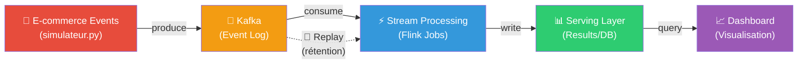

# 🔍 Analyse du Projet Kappa — État des Lieux & Plan d'Action

## 📋 Rappel du Sujet

> **Implémentation d'une architecture Kappa pour le traitement événementiel unifié**
> - Concevoir les **topologies de traitement événementiel**
> - Gérer la **rétention des événements**
> - Valider la **cohérence du système**
> - Cas d'usage : **flux d'événements comportementaux sur une plateforme e-commerce fictive**

---

## ✅ Ce qui a été fait (par votre coéquipier)

### 1. Infrastructure Docker (`docker-compose.yml`)
| Service | Image | Port | Status |
|---------|-------|------|--------|
| Zookeeper | `confluentinc/cp-zookeeper:7.3.0` | 22181 | ✅ Fonctionnel |
| Kafka (broker) | `confluentinc/cp-kafka:7.3.0` | 29092 | ✅ Fonctionnel |
| Flink JobManager | `flink:1.17` | 8081 | ⚠️ Déployé mais **non utilisé** |
| Flink TaskManager | `flink:1.17` | — | ⚠️ Déployé mais **non utilisé** |

### 2. Simulateur Python (`simulateur.py`)
- Produit des événements JSON aléatoires vers le topic Kafka `clics_ecommerce`
- Événements : `vue_produit`, `ajout_panier`, `achat_valide`, `abandon_panier`
- Produits : `PC_Gamer`, `Souris_Sans_Fil`, `Clavier_Mecanique`, `Ecran_4K`, `Casque_Audio`
- Envoi toutes les 2 secondes

### 3. Gestion de projet
- **Taiga** (Kanban) configuré avec 6 user stories
- **Gantt** créé (GanttProject) avec 6 phases
- **Screenshots** de preuve (Docker running, producer/consumer, Taiga board)
- Guide d'installation Docker/Taiga

### 4. Kanban board (Taiga) — État des tâches
| Tâche | Statut |
|-------|--------|
| #1 Rédiger docker-compose.yml | ✅ DONE |
| #2 Lancer les conteneurs Zookeeper et Kafka | ✅ DONE |
| #3 Coder le script Python simulateur.py | 🔶 IN PROGRESS |
| #4 Connecter Python au port 9092 de Kafka | 🔶 IN PROGRESS |
| #5 US Marketing : Capturer les clics en temps réel | 🔴 READY |
| #6 Rédiger le dossier de Gestion de Projet final | 🔴 READY |

---

## 🎯 Verdict : Sont-ils sur la bonne voie ?

### ✅ Ce qui est **ON TRACK** (sur la bonne voie)

1. **Le choix technologique est correct** — Kafka + Flink est exactement le stack standard pour une architecture Kappa
2. **Le simulateur e-commerce est pertinent** — Il génère des événements comportementaux réalistes (vue, panier, achat, abandon)
3. **L'infrastructure de base fonctionne** — Kafka reçoit et distribue bien les événements
4. **La gestion de projet** (Taiga + Gantt) est un bon point pour la présentation

### 🔴 Ce qui est **OFF TRACK** (manquant / hors piste)

> [!CAUTION]
> **Le cœur de l'architecture Kappa n'a PAS été implémenté.** Ce qui existe aujourd'hui est simplement un producteur Kafka + un consommateur console. Ce n'est **pas** une architecture Kappa.

Voici les **lacunes critiques** par rapport au sujet :

| Exigence du sujet | État | Gravité |
|---|---|---|
| **Topologies de traitement événementiel** (Flink jobs) | ❌ Absent | 🔴 Critique |
| **Rétention des événements** (replay, retention policy) | ❌ Absent | 🔴 Critique |
| **Validation de la cohérence du système** | ❌ Absent | 🔴 Critique |
| **Flux de traitement continu unique** (principe Kappa) | ❌ Absent | 🔴 Critique |
| Explication théorique Kappa vs Lambda | ❌ Absent | 🟡 Important |
| Dashboard / Visualisation des résultats | ❌ Absent | 🟡 Important |
| Documentation d'architecture | ❌ Absent | 🟡 Important |

> [!WARNING]
> Flink est déployé dans Docker mais **aucun job Flink n'a été créé**. C'est comme avoir une usine construite mais aucune machine à l'intérieur. Le simulateur envoie des données dans Kafka, mais **personne ne les traite**.

---

## 🗺️ Ce qu'est RÉELLEMENT une Architecture Kappa



**Ce qui existe aujourd'hui :** Seulement les blocs A et B (le simulateur et Kafka)
**Ce qui manque :** Les blocs C, D, E (traitement, stockage des résultats, visualisation) + la rétention/replay

---

## 🚀 Plan d'Action — Ce qu'il faut faire MAINTENANT

### Priorité 1 — Traitement Stream avec Flink (OBLIGATOIRE)

Créer au moins **2-3 jobs de traitement** en Python (PyFlink) ou via Flink SQL :

| Job | Description | Concept Kappa démontré |
|-----|-------------|----------------------|
| **Compteur temps réel** | Compter les événements par type (vues, achats, abandons) par fenêtre de 30s | Fenêtrage (windowing) |
| **Taux de conversion** | Ratio achats / vues par produit (fenêtre glissante 5 min) | Agrégation continue |
| **Détection d'anomalies** | Alerter si >5 abandons consécutifs sur un produit | Pattern matching |

### Priorité 2 — Rétention & Replay (OBLIGATOIRE)

- Configurer la **retention policy** du topic Kafka (ex: `retention.ms=86400000` pour 24h)
- Démontrer le **replay** : relancer un job Flink qui relit tout depuis le début
- C'est LE point clé de Kappa vs Lambda : on peut recalculer n'importe quel résultat en rejouant le log

### Priorité 3 — Validation de Cohérence (OBLIGATOIRE)

- Comparer les résultats du traitement temps réel vs le replay complet
- Montrer que les résultats sont **identiques** → preuve de cohérence du système
- C'est la validation que l'architecture Kappa fonctionne correctement

### Priorité 4 — Dashboard de Visualisation (RECOMMANDÉ)

- Un simple dashboard HTML/JS ou Grafana qui affiche les métriques en temps réel
- Montrer visuellement le flux de données de bout en bout

### Priorité 5 — Documentation & Présentation (RECOMMANDÉ)

- Schéma d'architecture complet
- Comparaison Kappa vs Lambda (pourquoi Kappa est plus simple)
- Explication des choix techniques

---

## 📁 Structure de projet recommandée

```
projet-kappa/
├── docker-compose.yml          # ✅ Existe (à améliorer)
├── simulateur.py               # ✅ Existe (à enrichir)
├── flink-jobs/                 # ❌ À CRÉER
│   ├── compteur_temps_reel.py  # Job 1 : comptage par fenêtre
│   ├── taux_conversion.py      # Job 2 : ratio achats/vues
│   └── detection_anomalies.py  # Job 3 : alertes
├── consumer/                   # ❌ À CRÉER
│   └── consumer.py             # Consommateur qui lit les résultats
├── dashboard/                  # ❌ À CRÉER (optionnel)
│   └── index.html              # Visualisation temps réel
├── config/                     # ❌ À CRÉER
│   └── kafka-retention.sh      # Script de config rétention
├── tests/                      # ❌ À CRÉER
│   └── test_coherence.py       # Test replay vs temps réel
├── docs/                       # ❌ À CRÉER
│   ├── architecture.md         # Schéma + explication Kappa
│   └── rapport_gestion.md      # Rapport de gestion de projet
└── README.md                   # ❌ À CRÉER
```

---

## 📊 Résumé pour la Présentation

| Slide | Contenu |
|-------|---------|
| 1 | Titre + équipe |
| 2 | Problématique : Pourquoi traiter des événements e-commerce en temps réel ? |
| 3 | Architecture Lambda vs Kappa (théorie) — Pourquoi Kappa est mieux |
| 4 | Notre architecture Kappa (schéma complet) |
| 5 | Stack technique : Kafka + Flink + Python |
| 6 | Démo : Simulateur → Kafka → Flink → Résultats |
| 7 | Rétention & Replay : rejeu depuis le début |
| 8 | Validation de cohérence : résultats identiques |
| 9 | Gestion de projet : Taiga Kanban + Gantt |
| 10 | Conclusion + perspectives |

---

## ⏰ Estimation du travail restant

| Tâche | Temps estimé | Qui |
|-------|-------------|-----|
| Créer les Flink jobs (ou scripts de stream processing alternatifs) | 4-6h | Dev |
| Configurer la rétention Kafka + démontrer le replay | 1-2h | Dev |
| Test de cohérence (replay vs real-time) | 2-3h | Dev |
| Dashboard simple | 2-3h | Dev |
| Documentation + slides | 3-4h | Tous |
| **Total** | **~12-18h** | |

> [!IMPORTANT]
> **En résumé** : Votre coéquipier a posé les fondations (infrastructure + simulateur + gestion de projet), mais il manque **l'essentiel du sujet** : le traitement stream, la rétention, et la validation de cohérence. Il faut compléter ces parties pour que le projet corresponde au sujet demandé.
